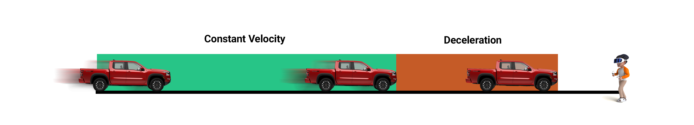

# **VR Study on Perception of Vehicle Deceleration**

Welcome to the repository for our Unity-based VR study, which investigates how distance and deceleration rates influence pedestrians' ability to perceive vehicle slowing. This project combines immersive technologies and human perception research to enhance understanding of pedestrian decision-making in road-crossing scenarios.

## Background & Motivation
Inspired by previous research where vehicles yielded to pedestrians, we observed that participants crossed earlier when vehicles decelerated gradually compared to abrupt stops. However, the time difference in crossing decisions was much smaller than the difference in stopping times between gradual and abrupt deceleration.

This prompted us to investigate whether gradual deceleration is harder to perceive, especially when vehicles begin slowing from a greater distance. The study examines how visual cues—such as motion, optic flow, and perspective—impact pedestrians' perception of deceleration in VR environments.

## Experiment Overview
Participants observed a virtual vehicle approaching them while wearing a VR headset. They were tasked with pressing a trigger button when they noticed the vehicle begin to decelerate.

The experiment consisted of 160 trials presented to participants in a random order. In half of these trials, the vehicle moved at a constant velocity without decelerating. In the other half, the vehicle decelerated with parameters chosen randomly from predefined categories, ensuring each category was sampled 10 times.

### Trial Parameters

| **Velocity (m/s)**    | **Deceleration (m/s²)** | **Movement with Constant Velocity** |                   | **Movement with Deceleration** |                   | **Total**         |                   |
|------------------------|--------------------------|-----------------------|-------------------|------------------|-------------------|-------------------|-------------------|
|                        |                          | **Distance (m)**      | **Time (s)**      | **Distance (m)** | **Time (s)**      | **Distance (m)**  | **Time (s)**      |
| 8.37 (18.72 mph)      | -1.4                   | 95                 | 11.35              | 25               | 5.98              | 120             | 17.33              |
| 10.58 (23.67 mph)      | -1.4                   | 80                 | 7.56              | 40               | 7.56              | 120             | 15.12              |
| 13.04 (29.17 mph)      | -3.4*                   | 95                 | 7.29              | 25               | 3.83              | 120             | 11.12              |
| 16.49 (36.89 mph)      | -3.4*                   | 80                 | 4.85              | 40               | 4.85              | 120             | 9.70              |
| 15.17 (33.93 mph)      | -4.6**                  | 95                 | 6.26              | 25               | 3.30              | 120             | 9.56              |
| 19.18 (42.90 mph)      | -4.6**                  | 80                 | 4.17              | 40               | 4.17              | 120             | 8.34              |
| 17.46 (39.06 mph)      | -6.1***                 | 95                 | 5.44              | 25               | 2.86              | 120             | 8.30              |
| 22.09 (49.41 mph)      | -6.1***                 | 80                 | 3.62              | 40               | 3.62              | 120             | 7.24              |

\* Safe | \** Average Driver Max | \*** Reasonably Skilled Driver Max

**Key Design Considerations**
* **Randomization:** Ensured unbiased presentation of constant velocity and deceleration trials.
* **Realism:** Selected values align with real-world driving conditions to maintain ecological validity.
* **Environmental Settings:** Three distinct environmental conditions to assess how visual cues affect the perception of vehicle deceleration.    
    * **Air:** Only the vehicle is present, with no additional environmental elements.
    * **Ground:** A planar surface and sky are added to provide a visible horizon line.
    * **Road:** A fully realistic environment is created, including a road and all associated elements.

  

  

  

   

## Current Status & Applications
* The results are currently being analyzed, with a manuscript in preparation.
* **Potential Applications:**
    * **Traffic Safety:** Enhancing crosswalk designs and vehicle behavior to improve pedestrian safety.
    * **Autonomous Vehicles:** Informing deceleration patterns that are intuitive for pedestrians to interpret.
    * **Virtual Reality & Simulation:** Contributing to driving simulators and pedestrian safety training programs that replicate realistic deceleration scenarios.
